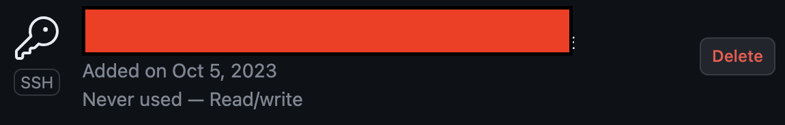

# Sourcetree, Github Permission denied

새로운 Github 계정 생성하면서 프로필 작성 중, 발생한 이슈.
SSH키 등록과 계정 갱신 등을 진행하였지만, Clone은 정상적으로 진행됨.
그러나, **Push**에서 *Permission denied* 이슈가 발생하였음.

이것을 해결하기 위해 Github Development Token을 발급받았고, Sourcetree 내 원격 저장소 InputField에 해당 값을 추가하여 대응함.

```
https://[GITHUB_TOKEN]@github.com/Kunnymann/kunnymann.git
```


그러나, 아직 해결되지 않은 궁금증이 존재한다.

```
사내에서 Gitlab을 사용할 때도, 이전 Github 계정에도 이런 절차는 필요하지 않았다.
SSH 발급 과정에서 다른 절차를 진행하진 않은 것 같은데... 무엇이 문제일까?
```

추후, Mac에서 Sourcetree 연동에 얽힌 이슈를 좀 해결해야겠습니다.

## 2023년 10월 6일, Mac 환경 테스트

Commit & Push 모두 정상적으로 진행되었다.

1. Sourcetree에 계정 등록 및 Personal Access Token 입력
2. SSH 키 생성 및 복사
3. Github에 등록
4. Sourcetree 계정 등록

위 절차만 따르면, Window와 다르게 문제가 없어보인다. 아마, 윈도우도 위와 같은 절차를 따르면 될 듯 싶다.

`잠만! 그런데, 생각해보니 어제 삽질해보며 했던 과정이긴 한데...`

라는 생각이 들어서... Github의 윈도우 SSH키 사용 전과를 확인해 보았는데...



흠... 아무래도 다시 데스크탑 앞으로 가야겠습니다.

## 2023년 10월 8일, Window 환경 테스트

큰일났다. 정상적으로 원격 저장소에 Push를 하지만, 키 사용 흔적이 없다...


당황스러워서, 다시 PUTTY로 재등록. 다시 Commit과 Push를 진행했으나, 여전히 Push는 정상. 그러나, 키 사용 흔적은 없음.

아... 생각해보니 Personal Access Token을 원격저장소 URL에 태우고 있었음. 지우고 다시 한 번 시도.

Mac에서 Sourcetree 계정 등록하면서 PAT 사용하였으니, Window에서도 계정 등록하면서 사용하겠구나 싶어, 시도하였으나...

```
Authentication failed for GitHub with username Kunnymann - please check your account settings.
```

혹시 몰라, Sourcetree 내 키체인을 삭제하고 다시 Push를 시도하여 계정 로그인을 요청받을 때, Password에 PAT를 입력해 보았습니다.

또 이 때는 잘 됩니다. 다시 계정 등록은 PAT로 시도하였을 때, 역시 동일한 오류가 발생하였습니다. 단순히 Sourcetree의 오류일까요?

드디어 해결했습니다! 문제는 **Personal Access Tokens**의 **Target scope**에 있었습니다!


약 2일의 삽질을 통해서 계정으로 등록할 수 있었습니다만, Mac의 PAT Scope는 User를 체크하지 않았습니다.

*설마 **Window 자격 증명**으로 PAT를 등록하는 방식과 Target Scope에 추가적으로 User를 등록한 방식이 같은 원리로 작동하나?*

위와 같은 의문이 들었습니다. 그래서, 제 아이디로 등록된 Github 자격 증명을 모조리 삭제한 후, 두 방법 모두 시행해보기로 하였습니다.