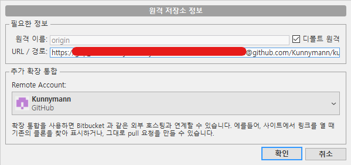

# Sourcetree, Github Permission denied

새로운 Github 계정 생성하면서 프로필 작성 중, 발생한 이슈.
SSH키 등록과 계정 갱신 등을 진행하였지만, Clone은 정상적으로 진행됨.
그러나, **Push**에서 *Permission denied* 이슈가 발생하였음.

이것을 해결하기 위해 Github Development Token을 발급받았고, Sourcetree 내 원격 저장소 InputField에 해당 값을 추가하여 대응함.

```
https://[GITHUB_TOKEN]@github.com/Kunnymann/kunnymann.git
```



그러나, 아직 해결되지 않은 궁금증이 존재한다.

```
사내에서 Gitlab을 사용할 때도, 이전 Github 계정에도 이런 절차는 필요하지 않았다.
SSH 발급 과정에서 다른 절차를 진행하진 않은 것 같은데... 무엇이 문제일까?
```

추후, Mac에서 Sourcetree 연동에 얽힌 이슈를 좀 해결해야겠습니다.

## 10.6, 맥 환경 테스트

Commit & Push 모두 정상적으로 진행되었다.

1. Sourcetree에 계정 등록 및 Personal Access Token 입력
2. SSH 키 생성 및 복사
3. Github에 등록
4. Sourcetree 계정 등록

위 절차만 따르면, Window와 다르게 문제가 없어보인다. 아마, 윈도우도 위와 같은 절차를 따르면 될 듯 싶다.

`잠만! 그런데, 생각해보니 어제 삽질해보며 했던 과정이긴 한데...`

라는 생각이 들어서... Github의 윈도우 SSH키 사용 전과를 확인해 보았는데...


흠... 아무래도 다시 데스크탑 앞으로 가야겠습니다.

## 10.8, 윈도우 환경 테스트

큰일났다. 정상적으로 원격 저장소에 Push를 하지만, 키 사용 흔적이 없다...


당황스러워서, 다시 PUTTY로 재등록.